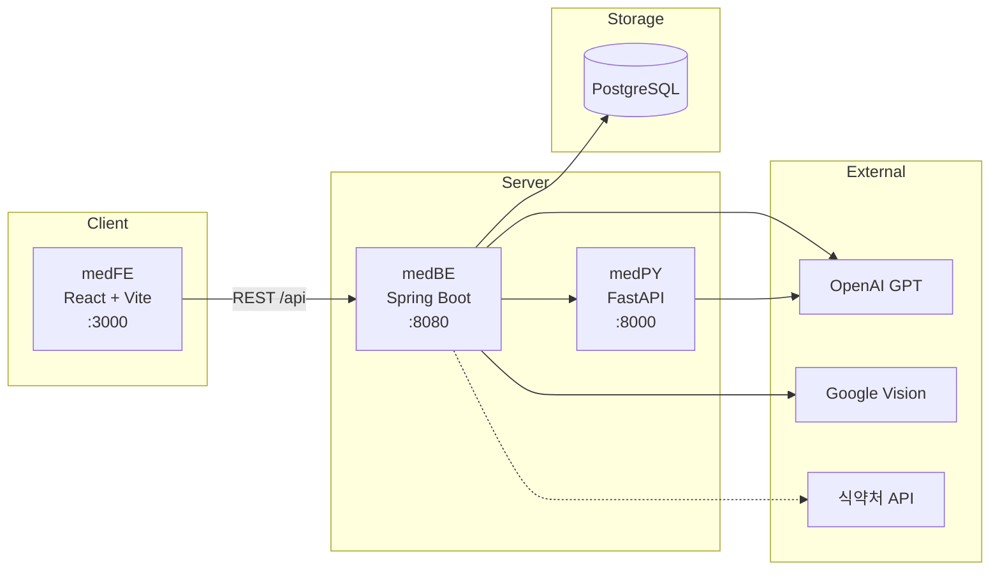
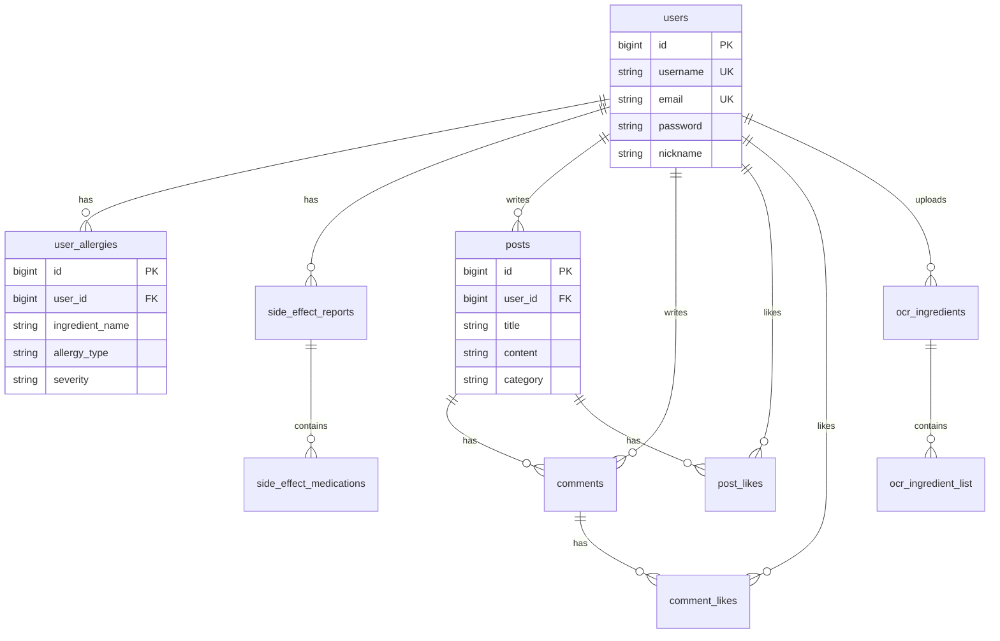

# Med


약물 알러지와 복용 경험을 기반으로, 안전한 약물을 추천하고 분석해 주는 개인 맞춤형 복약 안전성 확인 웹 서비스입니다.

| 항목 | 내용 |
|------|------|
| **상태** | 배포 완료 |
| **유형** | 개인 프로젝트 (1인 풀스택) |
| **시작 계기** | 동생의 항생제 알레르기로 인한 약 성분 확인 불편함에서 출발 |

---

## 목차

- [소개](#소개)
- [주요 기능](#주요-기능)
- [기술 스택](#기술-스택)
- [시스템 구조](#시스템-구조)
- [데이터베이스 설계](#데이터베이스-설계)
- [외부 API 키 및 필수 기능](#외부-api-키-및-필수-기능)
- [프로젝트 구조](#프로젝트-구조)
- [시작하기](#시작하기)
- [API 개요](#api-개요)
- [보안 · API 키 관리](#보안--api-키-관리)
- [참고](#참고)

---

## 소개

Med는 사용자가 등록한 알러지 정보와 복용 이력을 바탕으로 증상·부작용·성분표를 분석하고, 안전한 약물을 추천하는 풀스택 웹 애플리케이션입니다. 약 성분표 사진을 OCR로 읽고, GPT로 위험 성분을 분석하는 흐름까지 하나의 서비스로 연결합니다.

---

## 주요 기능

| 기능 | 설명 |
|------|------|
| **사용자 인증** | 회원가입·로그인, JWT 인증, 닉네임·비밀번호 변경, 이메일 아이디 찾기 |
| **알러지 관리** | 약물·식품 알러지 등록 (7개 식품 카테고리, 심각도 설정), 모든 분석에서 자동 참조 |
| **증상 분석** | 증상 입력 → GPT 기반 안전한 약 추천, 주의 약물·위험 요소 요약 |
| **부작용 분석** | 과거 부작용 약물 입력 → 공통·민감 성분 분석, 부형제 위험도 평가 |
| **OCR 성분표 분석** | 약 성분표 사진 업로드 → Google Vision OCR → GPT 위험도 분석 |
| **커뮤니티** | 게시글·댓글·좋아요, 카테고리 필터, 페이지네이션 |
| **의약품 검색** | 식품의약품안전처 API 연동 (선택) |

---

## 기술 스택

| 영역 | 기술 |
|------|------|
| **Frontend** (`medFE`) | React 18, TypeScript, Vite, Tailwind CSS, Zustand, Axios |
| **Backend** (`medBE`) | Spring Boot 3.3.5, Java 17, Spring Security, JWT, Spring Data JPA |
| **Analysis** (`medPY`) | Python 3.9+, FastAPI, Uvicorn, OpenAI |
| **Database** | PostgreSQL (로컬 또는 Supabase) |
| **외부 API** | OpenAI GPT-4o-mini, Google Cloud Vision, 식약처 API (선택) |
| **문서** | Springdoc OpenAPI (Swagger) |
| **배포** | Docker Compose, Nginx, Vercel (FE) |

---

## 시스템 구조



---

## 데이터베이스 설계

PostgreSQL 기반. 스키마 파일: `medBE/src/main/resources/db/schema.sql`



| 테이블 | 설명 |
|--------|------|
| `users` | 사용자 계정 |
| `user_allergies` | 약물·식품 알러지 (7개 식품 카테고리, 심각도) |
| `side_effect_reports` / `side_effect_medications` | 부작용 이력 |
| `ocr_ingredients` / `ocr_ingredient_list` | OCR 성분표 분석 결과 |
| `posts` / `comments` / `post_likes` / `comment_likes` | 커뮤니티 |

---

## 외부 API 키 및 필수 기능

| 환경 변수 | 필수 | 연동 기능 | 없을 때 |
|-----------|------|-----------|---------|
| `DB_URL` / `DB_USERNAME` / `DB_PASSWORD` | ✅ | 전체 서비스 (인증, 분석, 커뮤니티) | 서버 시작 불가 |
| `JWT_SECRET` | ✅ | 로그인·인증 API | 인증 불가 |
| `OPENAI_API_KEY` | ✅ | 증상 분석, 부작용 분석, OCR GPT 해석 | AI 분석 기능 비활성 |
| `PYTHON_API_URL` | ✅ | medBE → medPY 분석 서비스 호출 | 분석 API 실패 |
| `GOOGLE_APPLICATION_CREDENTIALS` | OCR 사용 시 | 약 성분표 OCR 텍스트 추출 | OCR 기능 비활성 |
| `MFDS_API_URL` / `MFDS_API_KEY` | 선택 | 의약품 DB 검색 | 검색 기능 비활성 |
| `MAIL_USERNAME` / `MAIL_PASSWORD` | 선택 | 이메일 아이디 찾기 | 메일 발송 비활성 |

> 템플릿: `medBE/.env.example` — 실제 키는 `.env`에만 저장 (gitignore됨)

---

## 프로젝트 구조

```
med/
├── medFE/          # 프론트엔드 (React + Vite)
│   └── src/
│       ├── api/        # API 클라이언트
│       ├── pages/      # 페이지 컴포넌트
│       └── store/      # Zustand 상태 관리
├── medBE/          # 백엔드 (Spring Boot)
│   └── src/main/java/com/sxxmwolf/med/
│       ├── auth/       # 인증·사용자·알러지
│       ├── analysis/   # 증상·부작용 분석
│       ├── ocr/        # OCR 성분표 분석
│       └── community/  # 게시글·댓글
└── medPY/          # 분석 서비스 (FastAPI)
    └── app/routers/    # ingredients, sideeffects, ocr
```

---

## 시작하기

### 사전 요구사항

- Node.js 18+
- Java 17+
- Python 3.9+
- PostgreSQL
- OpenAI API Key

### 1. 데이터베이스

```bash
psql -U postgres
CREATE DATABASE localMED_DB;
psql -U postgres -d localMED_DB -f medBE/src/main/resources/db/schema.sql
```

### 2. 백엔드 (medBE)

```bash
cd medBE
cp .env.example .env   # 값 입력
./gradlew bootRun
```

- 서버: `http://localhost:8080`
- Swagger: `http://localhost:8080/swagger-ui.html`

### 3. 분석 서비스 (medPY)

```bash
cd medPY
pip install -r requirements.txt
uvicorn main:app --reload --port 8000
```

### 4. 프론트엔드 (medFE)

```bash
cd medFE
npm install && npm run dev
```

- 앱: `http://localhost:3000` (Vite 프록시 `/api` → `:8080`)

### Docker Compose (프로덕션)

```bash
cd medBE && docker compose up -d
```

---

## API 개요

| 메서드 | 경로 | 설명 |
|--------|------|------|
| `POST` | `/api/auth/register` | 회원가입 |
| `POST` | `/api/auth/login` | 로그인 |
| `GET` | `/api/users/{id}/allergies` | 알러지 목록 |
| `POST` | `/api/analysis/symptom` | 증상 분석 |
| `POST` | `/api/analysis/side-effect` | 부작용 분석 |
| `POST` | `/api/analysis/ocr` | OCR 성분표 분석 |
| `GET` | `/api/posts` | 게시글 목록 |
| `GET` | `/api/health` | 헬스체크 |

전체 API는 Swagger UI에서 확인할 수 있습니다.

---

## 보안 · API 키 관리

- `.env`, `google-credentials.json` 등 **민감 파일은 `.gitignore` 처리**됨
- 코드베이스에 하드코딩된 API 키 없음 — 환경 변수로만 주입
- `medFE`는 프로덕션에서 `VITE_API_BASE_URL`만 사용, API 키는 **백엔드에만** 보관
- Docker Compose는 `${OPENAI_API_KEY}` 등 환경 변수 참조만 사용

---

## 참고

- 본 서비스는 의료 진단을 대체하지 않습니다. 실제 복약 결정은 반드시 의료 전문가와 상담하세요.
- 알러지·증상 분석은 GPT 기반이며, 결과는 참고용입니다.
